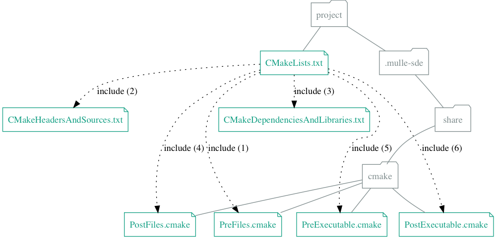

# 🧢 Enhanced cmake files for mulle-sde C development

This is a **buildtool** extension for [mulle-sde](/mulle-sde/mulle-sde). It supplements the **mulle-sde** builtin cmake files, with some useful functionality for C development.




**mulle-sde-c-developer** usually installs to `/usr/share/mulle-sde/mulle`  or `/usr/local/share/mulle-sde/mulle`.


## Create a **mulle-sde** "hello world" project with mulle-sde-c-developer


```
$ mulle-sde init -d hello -b mulle:cmake_c executable
```

