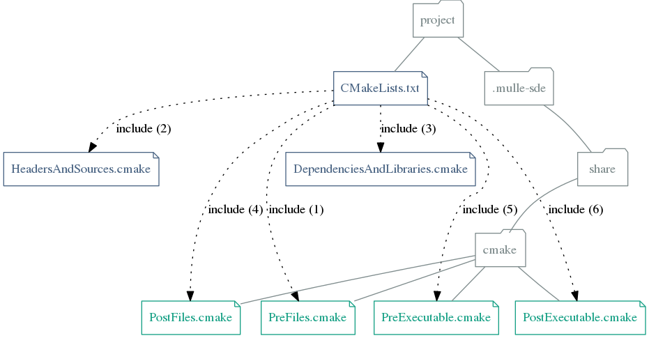

# 🧢 Enhanced cmake files for mulle-sde C development

This is a [mulle-sde](/mulle-sde/mulle-sde) *meta extension*.
It supplements the **mulle-sde** builtin cmake files, with useful
functionality for C development with mulle-c. It also adds all `mulle-c`
libraries as dependencies to your project.





Executable                   | Description
-----------------------------|--------------------------------
`mulle-c-sourcetree-update`  | Update src/dependencies.h from mulle-sourcetree


## Install

OS    | Command
------|------------------------------------
macos | `brew install mulle-kybernetik/software/mulle-c-developer`
other | ./install.sh  (Requires: [mulle-sde-c](https://github.com/mulle-sde/mulle-sde-c) and [mulle-sde-cmake](https://github.com/mulle-sde/mulle-sde-cmake))


**mulle-c-developer** usually installs to `/usr/share/mulle-sde/mulle-c` or
`/usr/local/share/mulle-sde/mulle-c`.

After installation check with `mulle-sde extension list` that the extensions
are discovered by **mulle-sde**

```
$ mulle-sde extension list | grep mulle-c
Available meta extensions [-m <extension>]:
mulle-c:cmake-c
Available common extensions [-c <extension>]:
Available runtime extensions [-r <extension>:
mulle-c:c
Available buildtool extensions [-b <extension>]:
mulle-c:cmake
```

## Usage

### Create an executable mulle-c project

```
mulle-sde init -d hello-exe -m mulle-c:cmake-c executable
```

### Create a library mulle-c project

```
mulle-sde init -d hello-lib -m mulle-c:cmake-c library
```

If you don't want the `mulle-c` dependencies, but like the added
functionality by mulle-c:cmake do:

```
mulle-sde init -d hello-lib -m mulle-sde/cmake-c -b mulle-c:cmake library
```


